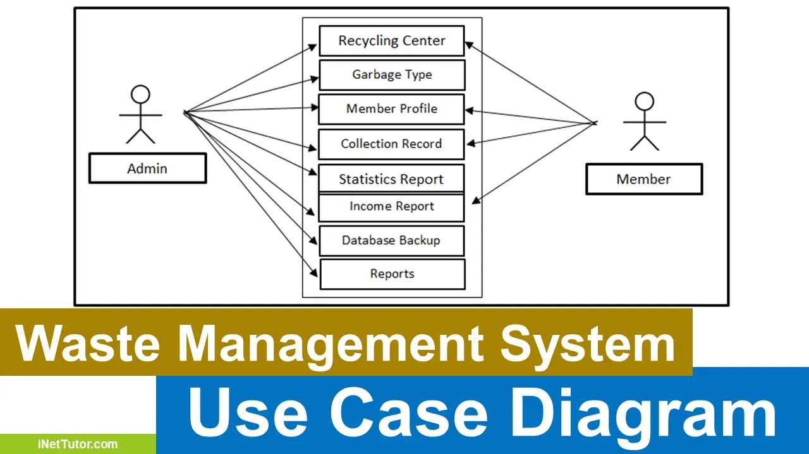

# Smart India Hackathon Workshop
# Date:23-11-2024
## Register Number:24900151
## Name:S.Ravant Vignesh
## Problem Title
Sustainable Alumni Partnership for Waste Recycling and Circular Economy

## Problem Description
The project aims to create a sustainable ecosystem by engaging alumni in innovative waste recycling and management initiatives for the university or institute. Alumni will contribute through mentorship, funding, and participation in recycling programs that benefit the campus and surrounding community. This initiative also fosters environmental responsibility, builds stronger alumni ties, and inspires students to champion sustainability.
## Problem Creater's Organization
Ministry of Environment

## Idea
1. Campus Recycling Drive
Objective: Engage alumni in a campus-wide waste recycling and management initiative.
Execution:
Alumni sponsor or participate in installing recycling bins and composting units.
Organize collection drives for electronic waste, paper, and plastic.
Introduce competitions for students and alumni to promote recycling.
2. Alumni-Sponsored Waste-to-Art Workshops
Objective: Convert waste into creative art or functional items to raise awareness.
Execution:
Alumni provide funding or expertise for workshops.
Students and alumni collaborate to create art from waste materials like plastic bottles, e-waste, or fabric scraps.
Host exhibitions or auctions to display and sell creations, with proceeds supporting sustainability projects.
3. Zero-Waste Event Framework
Objective: Create guidelines for zero-waste alumni events.
Execution:
Use biodegradable cutlery, reusable decorations, and avoid single-use plastics.
Encourage attendees to bring reusable bottles and containers.
Alumni can sponsor initiatives like composting leftover food from events.
4. Alumni-Led Waste Innovation Hackathon
Objective: Encourage innovative recycling solutions through alumni mentorship.
Execution:
Alumni experts mentor teams in solving waste management issues.
Categories: e-waste recycling, bio-waste conversion, upcycling plastics.
Fund pilot projects from winning ideas to implement on campus or in the community.
5. Recycling Technology Incubator
Objective: Support start-ups or projects focused on recycling innovation.
Execution:
Alumni in engineering or entrepreneurship provide mentorship and funding.
Focus areas: automated waste sorting, biodegradable packaging, energy from waste.
Showcase successful projects during alumni reunions.
6. Sustainable Alumni Merchandise
Objective: Offer eco-friendly alumni association merchandise.
Execution:
Recycled materials (plastic, paper, etc.) used to create T-shirts, mugs, or bags.
Promote the merchandise as a sustainable branding initiative.
A portion of profits funds recycling initiatives or awareness campaigns.
7. E-Waste Collection Network
Objective: Create a system for alumni and students to recycle e-waste responsibly.
Execution:
Alumni collaborate with certified e-waste recyclers.
Set up drop-off points at alumni gatherings or the campus.
Partner with tech companies for incentives, like discounts on new gadgets for e-waste contributions.
8. Composting Program for Organic Waste
Objective: Build a composting system to convert organic waste into fertilizer.
Execution:
Alumni sponsor or volunteer to set up composting units on campus.
Conduct workshops on composting for students and local communities.
Use compost in campus gardens or distribute it for agricultural use.
9. Plastic-Free Campus Campaign
Objective: Alumni and students collaborate to reduce plastic usage on campus.
Execution:
Replace plastic packaging in canteens with biodegradable alternatives.
Alumni sponsor reusable water bottles or bags for students.
Host awareness events about the environmental impact of plastic waste.
10. Waste Awareness App
Objective: Develop an app to educate and engage alumni and students in recycling.
Features:
Alumni can share waste management tips and resources.
Gamified recycling activities with leaderboards and rewards.
Map of local recycling centers and waste collection drives.
11. Circular Economy Alumni Network
Objective: Connect alumni working in sustainability to collaborate on waste management.
Execution:
Create a platform for alumni to share case studies, research, and best practices.
Host webinars or panel discussions on circular economy principles.
Initiate projects like turning waste paper into notebooks or textiles into reusable bags.
12. Recycling Scholarships
Objective: Provide scholarships funded by alumni for students innovating in recycling.
Execution:
Reward projects that improve campus or community waste management.
Alumni judge applications and mentor recipients.
Showcase scholarship winners and their projects at alumni events.
13. Green Alumni Reunion
Objective: Host a reunion focused on sustainability and waste reduction.
Execution:
Include workshops, panel discussions, and exhibitions on recycling.
Offset event carbon footprints with tree planting or carbon credits.
Encourage alumni to bring and share sustainable solutions they've implemented in their workplaces.
14. Sustainable Internship Program
Objective: Alumni companies offer internships focused on waste management.
Execution:
Partner with alumni in industries like recycling, renewable energy, or sustainable packaging.
Students gain practical experience while alumni contribute to education and awareness.
15. Waste-to-Wealth Alumni Fund
Objective: Alumni invest in projects that convert waste into valuable products.
Execution:
Focus on initiatives like plastic-to-bricks, biofuels, or recycled textiles.
Alumni act as mentors or investors in these start-ups.
Revenue generated is reinvested into more recycling projects.
16. Community Recycling Hub
Objective: Establish a community waste collection and recycling hub with alumni support.
Execution:
Alumni contribute resources to set up the hub.
Partner with local communities for waste collection and segregation.
Organize awareness campaigns in schools and neighborhoods.

## Proposed Solution / Architecture Diagram

## Use Cases

## Technology Stack
React.js

Node.js

PostgreSQL

Google maps

Firebox Authenticator

Git , Postman or Insomnia

## Dependencies
Mapping service- 10 days

Data collection- 10 days

budget- rs.50,000

